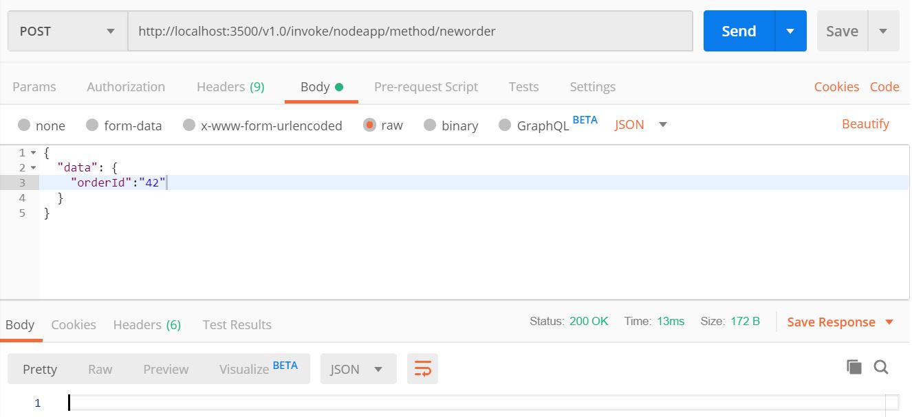

# Hello World

This tutorial will demonstrate how to get Dapr running locally on your machine. We'll be deploying a Node.js app that subscribes to order messages and persists them. The following architecture diagram illustrates the components that make up this sample: 


## Prerequisites
This sample requires you to have the following installed on your machine:
- [Docker](https://docs.docker.com/)
- [Node.js version 8 or greater](https://nodejs.org/en/) 
- [Postman](https://www.getpostman.com/) [Optional]

## Step 1 - Setup Dapr 

Follow [instructions](https://github.com/dapr/docs/blob/master/getting-started/environment-setup.md#environment-setup) to download and install the Dapr CLI and initialize Dapr.

## Step 2 - Understand the Code

Now that we've locally set up Dapr, clone the repo, then navigate to the Hello World sample: 

```bash
git clone https://github.com/dapr/samples.git
cd samples/1.hello-world
```


In the `app.js` you'll find a simple `express` application, which exposes a few routes and handlers. First, let's take a look at the `stateUrl` at the top of the file: 

```js
const stateUrl = `http://localhost:${daprPort}/v1.0/state`;
```
When we use the Dapr CLI, it creates an environment variable for the Dapr port, which defaults to 3500. We'll be using this in step 3 when we POST messages to to our system.

Next, let's take a look at the ```neworder``` handler:

```js
app.post('/neworder', (req, res) => {
    const data = req.body.data;
    const orderId = data.orderId;
    console.log("Got a new order! Order ID: " + orderId);

    const state = [{
        key: "order",
        value: data
    }];

    fetch(stateUrl, {
        method: "POST",
        body: JSON.stringify(state),
        headers: {
            "Content-Type": "application/json"
        }
    }).then((response) => {
        console.log((response.ok) ? "Successfully persisted state" : "Failed to persist state");
    });

    res.status(200).send();
});
```

Here we're exposing an endpoint that will receive and handle `neworder` messages. We first log the incoming message, and then persist the order ID to our Redis store by posting a state array to the `/state` endpoint.

Alternatively, we could have persisted our state by simply returning it with our response object:

```js
res.json({
        state: [{
            key: "order",
            value: order
        }]
    })
```

We chose to avoid this approach, as it doesn't allow us to verify if our message successfully persisted.

We also expose a GET endpoint, `/order`:

```js
app.get('/order', (_req, res) => {
    fetch(`${stateUrl}/order`)
        .then((response) => {
            return response.json();
        }).then((orders) => {
            res.send(orders);
        });
});
```

This calls out to our Redis cache to grab the latest value of the "order" key, which effectively allows our Node.js app to be _stateless_. 

> **Note**: If we only expected to have a single instance of the Node.js app, and didn't expect anything else to update "order", we instead could have kept a local version of our order state and returned that (reducing a call to our Redis store). We would then create a `/state` POST endpoint, which would allow Dapr to initialize our app's state when it starts up. In that case, our Node.js app would be _stateful_.

## Step 3 - Run the Node.js App with Dapr

1. Install dependencies: `npm install`. This will install `express` and `body-parser`, dependencies that are shown in our `package.json`.

2. Run Node.js app with Dapr: `dapr run --app-id mynode --app-port 3000 --port 3500 node app.js`. This should output text that looks like the following, along with logs:

```
Starting Dapr with id mynode on port 3500
You're up and running! Both Dapr and your app logs will appear here.
...
```
> **Note**:  The Dapr `--port` parameter with the `run` command is optional, and if not supplied, a random available port is used.

## Step 4 - Post Messages to your Service

Now that Dapr and our Node.js app are running, let's POST messages against it. **Note**: here we're POSTing against port 3500 - if you used a different port, be sure to update your URL accordingly.

You can do this using `curl` with:

```sh
curl -XPOST -d @sample.json http://localhost:3500/v1.0/invoke/mynode/method/neworder
```

You can also do this using Visual Studio Code [Rest Client Plugin](https://marketplace.visualstudio.com/items?itemName=humao.rest-client)

[sample.http](sample.http)
```http
POST http://localhost:3500/v1.0/invoke/mynode/method/neworder

{
  "data": {
    "orderId": "42"
  } 
}
```

Or you can use the Postman GUI

Open Postman and create a POST request against `http://localhost:3500/v1.0/invoke/mynode/method/neworder`

In your terminal window, you should see logs indicating that the message was received and state was updated:
```bash
== APP == Got a new order! Order ID: 42
== APP == Successfully persisted state
```

## Step 5 - Confirm Successful Persistence

Now, let's just make sure that our order was successfully persisted to our state store. Create a GET request against: `http://localhost:3500/v1.0/invoke/mynode/method/order`. **Note**: Again, be sure to reflect the right port if you chose a port other than 3500.

```sh
curl http://localhost:3500/v1.0/invoke/mynode/method/order
```

or using Visual Studio Code [Rest Client Plugin](https://marketplace.visualstudio.com/items?itemName=humao.rest-client)

[sample.http](sample.http)
```http
GET http://localhost:3500/v1.0/invoke/mynode/method/order
```

Or use the Postman GUI


This invokes the `/order` route, which calls out to our Redis store for the latest data. Observe the expected result!

## Step 6 - Cleanup

To stop your services from running, simply stop the "dapr run" process. Alternatively, you can spin down each of your services with the Dapr CLI "stop" command. For example, to spin down your Node service, run: 

```bash
dapr stop --app-id mynode
```

To see that services have stopped running, run `dapr list`, noting that your service no longer appears!

## Next Steps

Now that you've gotten Dapr running locally on your machine, see the [Hello Kubernetes](../2.hello-kubernetes) to get set up in Kubernetes!
