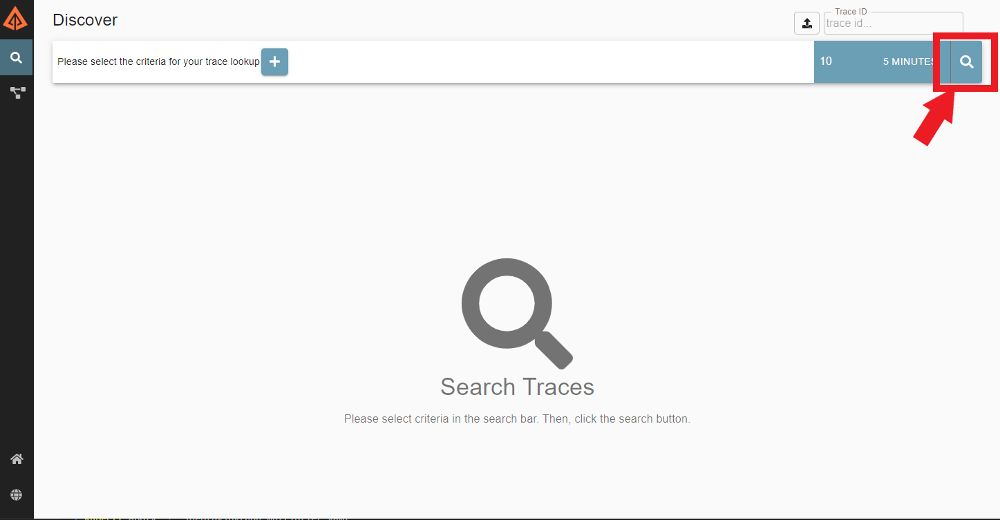
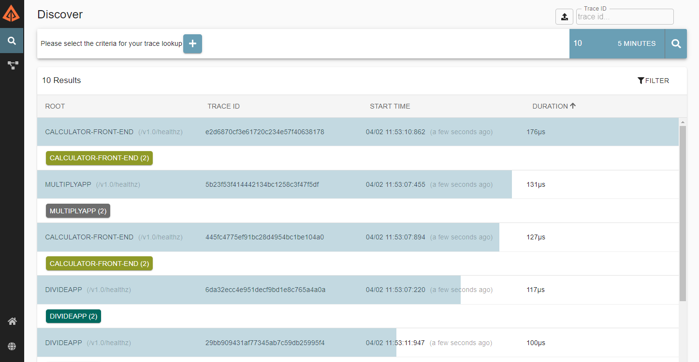
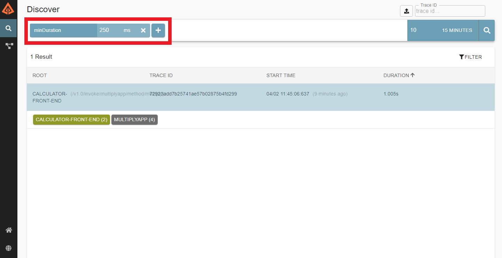

# Observability with Dapr

This sample explores the [observability](https://github.com/dapr/docs/blob/master/concepts/observability/README.md) capabilities of Dapr. Observability includes metric collection, tracing, logging and health checks. In this sample you'll be enabling [distributed tracing](https://github.com/dapr/docs/tree/master/concepts/observability/traces.md) on an application without changing any application code or creating a dependency on any specific tracing system. Since Dapr uses [OpenTelemetry](https://opentelemetry.io/), a variety of observability tools can be used to view and capture the traces.  In this sampple you'll be using [Zipkin](https://zipkin.io/).

In this sample you will;

- Deploy Zipkin and configure it as a tracing provider for Dapr in Kubernetes.
- Instrument an application for tracing and then deploy it.
- Troubleshoot a performance issue.

## Prerequisites

This sample builds on the [distributed calculator](../3.distributed-calculator/README.md) sample and requires Dapr to be installed on a Kubernetes cluster along with state store. It is suggested to go through the distributed calculator sample before this one, which sets you up ready for this sample. If you have not done this then;

1. Clone this repo using `git clone https://github.com/dapr/samples.git`

2. [Install Dapr on Kubernetes](https://github.com/dapr/docs/blob/master/getting-started/environment-setup.md#installing-dapr-on-a-kubernetes-cluster).
3. [Configure Redis](https://github.com/dapr/docs/tree/master/howto/configure-redis) as a state store for Dapr.

## Configure Dapr tracing in the cluster

Review the Dapr configuration file *./deploy/tracing.yaml* below:

```yaml
apiVersion: dapr.io/v1alpha1
kind: Configuration
metadata:
  name: appconfig
spec:
  tracing:
    enabled: true
    expandParams: true
    includeBody: true
```

This configuration file enables Dapr tracing. Deploy the configuration by running:

`kubectl apply -f ./deploy/tracing.yaml`

## Deploy Zipkin to the cluster and set it as the tracing provider

In this sample Zipkin is used for tracing. Examine [*./deploy/zipkin.yaml*](./deploy/zipkin.yaml) and see how it includes three sections:

1. A **Deployment** for Zipkin using the *openzipkin/zipkin* docker image.
2. A **Service** which will expose Zipkin internally as a ClusterIP in Kubernetes.
3. A **Component** that defines Zipkin as the tracing provider for Dapr.

Deploy Zipkin to your cluster by running:

`kubectl apply -f ./deploy/zipkin.yaml`

Now that Zipkin is deployed, you can access the Zipkin UI by creating a tunnel to the internal Zipkin service you just created by running:

`kubectl port-forward svc/zipkin 9411:9411`

On your browser go to [http://localhost:9411](http://localhost:9411). You should be able to see the Zipkin dashboard.

## Instrument the application for tracing and deploy it

To instrument a service for tracing with Dapr, no code changes are required, Dapr handles all of the tracing using the Dapr side-car. All that is needed is to add the Dapr annotation for the configuration (which enables tracing) in the applicaton deployment yaml along with the other Dapr annotations. The configuration annotation looks like this:

```yaml
...
annotations:
...
    dapr.io/config: "appconfig"
...
 ```

For this sample, a configuration has already been enabled for every service in the distributed calculator app. You can find the annotation in each one of the calculator yaml files. For example review the yaml file for the calculator front end service [here](https://github.com/dapr/samples/blob/master/3.distributed-calculator/deploy/react-calculator.yaml#L36).

Note you did not introduce any dependency on Zipkin into the calculator app code or deployment yaml files. The Zipkin Dapr component is configured to read tracing events and write these to an exporter.

Now deploy the distributed calculator application to your cluster following the instructions found in sample [3.distributed-calculator](https://github.com/dapr/samples/blob/master/3.distributed-calculator/README.md). Then browse to the calculator UI.

> **Note:** If the distributed calculator is already running on your cluster you will need to restart it for the tracing to take effect. You can do so by running:

> `kubectl rollout restart deployment addapp calculator-front-end divideapp multiplyapp subtractapp`

## Discover and troubleshoot a performance issue using Zipkin

To show how observability can help discover and troubleshoot issues on a distributed application, you'll update one of the services in the calculator app. This updated version simulates a performance degradation in the multiply operation of the calculator that you can then investigate using the traces emitted by the Dapr sidecar. Run the following to apply a new version of the python-multiplier service:

`kubectl apply -f ./deploy/python-multiplier.yaml`

Now go to the calculator UI and perform several calculations. Make sure to use all operands. For example, do the following:

`9 + 3 * 2 / 4 - 1 =`

Now go to the Zipkin dashboard by running:

`kubectl port-forward svc/zipkin 9411:9411`

And browsing to [http://localhost:9411](http://localhost:9411). Click the search button to view tracing coming from the application:



Dapr adds a HTTP/gRPC middleware to the Dapr sidecar. The middleware intercepts all Dapr and application traffic and automatically injects correlation IDs to trace distributed transactions. You can see a lot of transactions are being captured including the regular health checks done by Kubernetes:



Now look for any performance issues by filtering on any requests that have taken longer than 250 ms using the `minDuration` criteria:



You can quickly see that the multiply method invocation is unusually slow (takes over 1 second). Since the problem may be either at the calculator-frontend service or the python-multiplier service you can dig further by clicking on the entry:


Now you can see which specific call was delayed via the `data` field (here it's the 12 * 2 operation) and confirm that it is the multiplier service which you updated that is causing the slowdown (You can find the code for the slow multiplier under the python directory).

## Clean up

1. To remove the distributed calculator application from your cluster run:

`kubectl delete -f ..\3.distributed-calculator\deploy`

2. To remove the Zipkin installation and tracing configuration run:

`kubectl delete -f deploy\tracing.yaml -f deploy\zipkin.yaml`

## Additional Resources:

- Learn more about [observability](https://github.com/dapr/docs/tree/master/concepts/observability).
- Learn more on how Dapr does [distributed tracing](https://github.com/dapr/docs/tree/master/concepts/observability/traces.md).
- As an alternative to Zipkin see [how to configure tracing with Application Insights](https://github.com/dapr/docs/tree/master/howto/diagnose-with-tracing/azure-monitor.md).  
